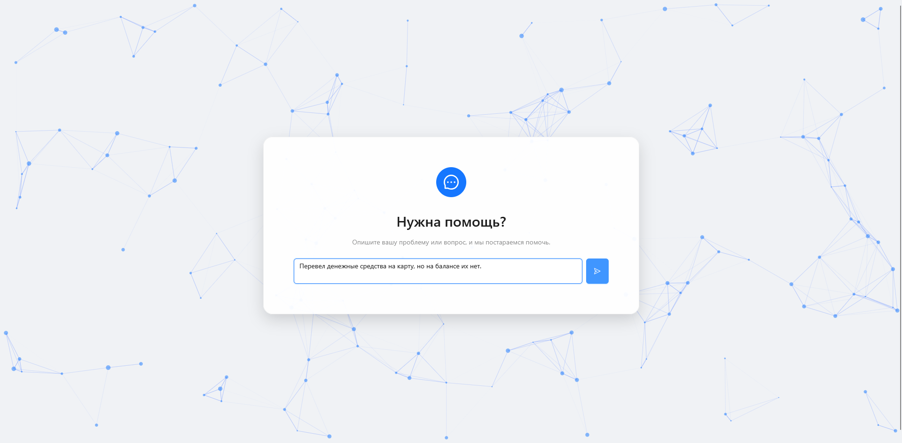
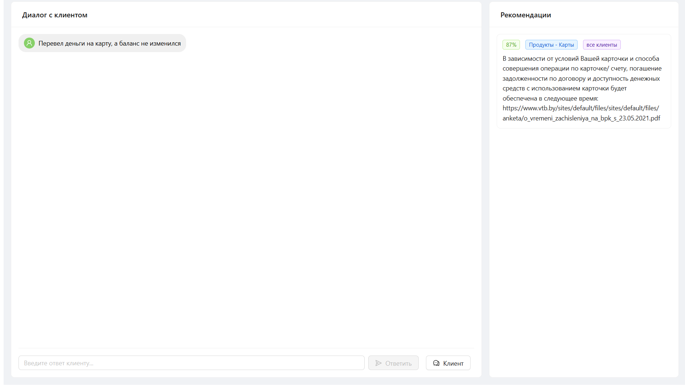
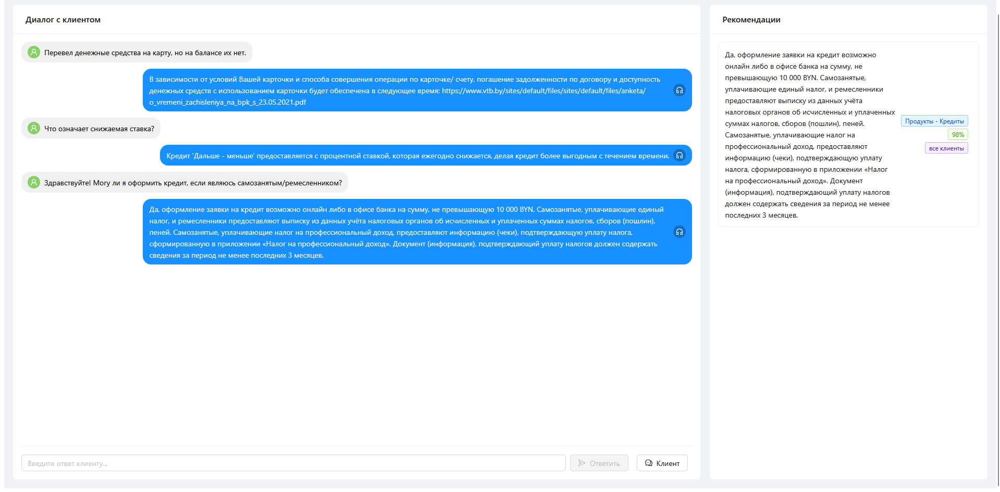
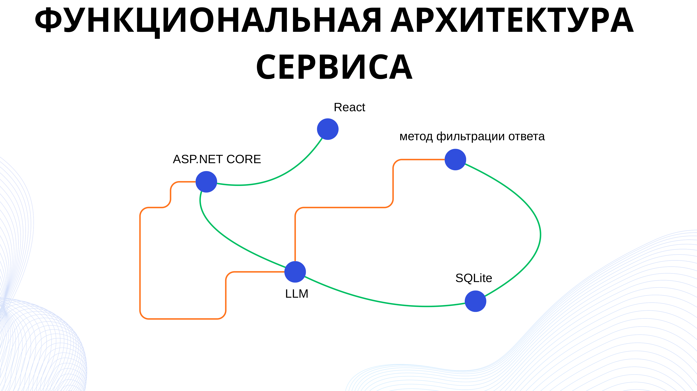

# Smart Support 🚀

[](docs/assets/SmartSupport_full.gif)  
*Демонстрация работы платформы: от ввода запроса до обработки и отправки ответа. GIF показывает полный цикл с несколькими примерами (.gif демонстрация без потерь в docs/assets/). Для полного видео процесса можно посмотреть на [YouTube](https://youtu.be/fjY7E7N7Tso)* 📹


## 📋 Оглавление
- [Описание](#description)
- [Технический стек](#tech-stack)
- [Функциональность](#functionality)
- [Сценарий использования Веб-Сервиса](#web-service-usage)
- [Применимость Smart Support](#smart-support-applicability)
- [Установка и запуск](#installation-and-launch)
- [Использование](#usage)
- [Архитектура](#architecture)
- [Команда и Контакты](#team-and-contacts)
- [Дополнительные материалы](#additional-materials)


<h2 id="description">Описание 📝</h2>
Smart Support — интеллектуальная платформа поддержки для сотрудников банка, которая автоматизирует обработку клиентских запросов с использованием ИИ. Система интегрирует машинное обучение и обработку естественного языка для быстрого анализа обращений, поиска релевантных шаблонов ответов и предложения готовых решений операторам. Это снижает время обработки, повышает точность и оптимизирует работу колл-центра. ⚡<br>  
<br>
<br>

**Описание задачи от T1:**  
Участники создают интеллектуальную систему поддержки, которая трансформирует процесс обработки клиентских обращений через интеграцию передовых технологий машинного обучения и обработки естественного языка. Система построена на основе платформы Scibox и использует возможности больших языковых моделей для комплексного анализа входящих запросов. Модуль автоматической классификации анализирует текст обращения клиента и определяет продуктовую категорию с высокой точностью. Модуль ранжирования сортирует найденные шаблоны по релевантности, принимая во внимание историю успешных решений и специфику текущего запроса. Система включает механизм непрерывного обучения, который анализирует обратную связь операторов и клиентов для улучшения точности классификации и релевантности предлагаемых решений. Веб-интерфейс для операторов обеспечивает интуитивное взаимодействие с системой, отображая результаты анализа в структурированном виде с возможностью быстрого редактирования предлагаемых ответов.

**Проблемы, которые решает:** 💼
- Долгое время обработки запросов клиентов
- Низкая точность классификации вопросов
- Рост количества сотрудников
- Непредсказуемое качество обслуживания пользователей

**Возможности:** ✅
- Удобный веб-интерфейс для операторов
- Централизованная база знаний
- Масштабируемость и гибкость

Разработано на Хакатоне T1 в Минске, октябрь 2025. 🏆

<h2 id="tech-stack">Технический стек 🛠️</h2>

- **Frontend:** React + JavaScript
- **Backend:** ASP.NET Core на C#
- **База данных:** SQLite
- **ИИ-компоненты:** SciBox API (модель bge-m3 для эмбеддингов и семантического анализа)
- **Инструменты:** Git/GitHub для версионного контроля, Entity Framework для работы с БД, Postman для тестирования API

<h2 id="functionality">Функциональность 🎯</h2>

Smart Support работает по следующему workflow: 🔄

1. **Получение запроса**
    - Клиент отправляет текстовое обращение через веб-интерфейс.
    - Запрос передаётся на backend (ASP.NET Core) для обработки.
      
        
      *Стартовый интерфейс: пользователь вводит вопрос в чат.*

2. **Извлечение ключевых сущностей**
    - Запрос к языковой модели → определение основной категории.
    - Запрос к embedding-модели → получение векторного представления запроса.

3. **Поиск шаблонных ответов**
    - Фильтрация по категории.
    - Фильтрация по embedding → топ 10 похожих шаблонов.

4. **Оценка релевантности шаблонов**
    - Отфильтрованный список передаётся в нейросеть.
    - Выполняется анализ соответствия между текстом запроса и каждым шаблоном:
        - embedding-сравнение
        - процент совпадения

5. **Финальная фильтрация**
    - Оставляются ответы с наибольшим процентом совпадения

6. **Отправка на Frontend**
    - Список релевантных шаблонов передаётся в React-интерфейс.
    - Оператор видит предложенные варианты и может их отредактировать, отправить.


<h2 id="web-service-usage">Сценарий использования Веб-Сервиса 📋</h2>

- **Этап 1: Получение запроса** — Клиент отправляет сообщение через чат, запрос поступает в интерфейс оператора.
- **Этап 2: Извлечение сущностей** — Категория, подкатегория, целевая аудитория.
- **Этап 3: Поиск шаблонных ответов** — Система фильтрует шаблоны; если нет полного совпадения — остаются частично релевантные.
- **Этап 4: Семантический анализ** — Отфильтрованные ответы передаются в SciBox; вычисляется процент совпадения; остаются наиболее точные.
        
      *Интерфейс оператора: отображены рекомендации из API, клик по ним копирует шаблон в поле ответа.*

- **Этап 5: Отправка подсказок оператору и ответ пользователю** — Оператор получает список готовых ответов; специалист выбирает подходящий вариант и отправляет клиенту.
    
  *Завершённый диалог: обработано 3 вопроса пользователя с использованием шаблонов.*

<h2 id="smart-support-applicability">Применимость Smart Support 🌐</h2>

**Целевая аудитория 👥:** 
- Оператор
- Аналитик 
- Клиент

**Задачи в системе:**
- Быстро и точно отвечать на запросы
- Отслеживать качество, выполнять паттерны
- Получать быстрые, точные ответы

**Сферы применения:**
- Банк / финансы 💰
- Страховая 🛡️
- SaaS/IT-сервис 💻
- Госуслуги/B2C 🏛️

**Примеры задач поддержки:**
- Переводы, блокировки, ошибки тарифы
- Полисы, выплаты, документы, сроки
- Техподдержка, баги, лицензии, доступы
- Запросы граждан, справки, обращения

**Улучшаемые метрики 📊:** 
- Скорость обработки — сокращение ответа до 2-3 секунд
- Точность ответов — снижение ошибок и эскалаций
- Операционные затраты — меньше обучение, меньше компенсации

**Гибкость и масштабируемость 🔄:** 
- Мультиязычность
- Кастомизация шаблонов
- Интеграция
- Поддержка разных языков
- Настройка ответов под стиль компании
- API, SaaS-модель, on-premise для корпоративных клиентов

<h2 id="installation-and-launch">Установка и запуск 🐳</h2>

Данный проект использует **Docker Compose** для упрощения развёртывания. Перед началом убедитесь, что на вашей машине установлены **Docker** и **Docker Compose**.

### 1. Клонирование репозитория

```bash
git clone https://github.com/Promtanators/SmartSupport.git
cd SmartSupport
```

### 2. Настройка переменных окружения (Метод 1: Через .env)

В корневой директории проекта создайте файл `.env` и добавьте в него ваш API-ключ:

```env
SCIBOX_API_KEY=your_actual_token_here
```

> **Примечание:** Замените `your_actual_token_here` на действительный токен SciBox. 🔑

### 3. Запуск контейнеров (Метод 1: С .env)

Для сборки и запуска всех сервисов в фоновом режиме выполните:

```bash
docker compose up -d --build
```

### Альтернативный метод запуска без .env (Метод 2)

- **На Windows:**
  ```powershell
  $env:SCIBOX_API_KEY="your_actual_token_here"; docker compose up --build -d
  ```

- **На Linux/macOS:**
  ```bash
  SCIBOX_API_KEY="your_actual_token_here" docker compose up --build -d
  ```

После успешного запуска:
* **Backend** доступен по адресу: [http://localhost:5000](http://localhost:5000)
* **Frontend** доступен по адресу: [http://localhost:8080](http://localhost:8080)

<h2 id="usage">Использование 🔧</h2>

### API-эндпоинты

- **POST /api/v1/ask**  
  Ключевой эндпоинт для обработки запросов и выдачи рекомендаций.  
  **Запрос:**
  ```json
  {
    "message": "string"
  }
  ```  
  **Пример 1:**
  ```json
  {
    "message": "Как стать клиентом банка?"
  }
  ```  
  **Ответ:**
  ```json
  {
      "recommendations": [
          {
              "answer": "Стать клиентом ВТБ (Беларусь) можно онлайн через сайт vtb.by или мобильное приложение VTB mBank. Для регистрации потребуется паспорт и номер телефона. После регистрации через МСИ (Межбанковскую систему идентификации) вы получите доступ к банковским услугам.",
              "score": 91,
              "mainCategory": "Новые клиенты",
              "subCategory": "",
              "targetAudience": "новые клиенты"
          }
      ]
  }
  ```

  **Пример 2:**
  ```json
  {
    "message": "Здраствуйте! Подскажите что делать, если забыл пароль от аккаунта"
  }
  ```  
  **Ответ:**
  ```json
  {
      "recommendations": [
          {
              "answer": "Если Вы забыли логин или пароль доступа, доступна процедура восстановления доступа к системе ДБО со стартового экрана. Для этого требуется нажать на кнопку «Забыли логин или пароль?».",
              "score": 79,
              "mainCategory": "Техническая поддержка",
              "subCategory": "",
              "targetAudience": "все клиенты"
          },
          {
              "answer": "Если не получается войти в Интернет-банк, проверьте правильность ввода логина и пароля. При забытом пароле воспользуйтесь функцией восстановления. Если проблема не решается, обратитесь в контакт-центр по номеру 250 или +375 (17/29/33) 309 15 15.",
              "score": 62,
              "mainCategory": "Техническая поддержка",
              "subCategory": "",
              "targetAudience": "все клиенты"
          }
      ]
  }
  ```

- **POST /api/v1/fastask**  
  Аналог /ask, но на основе только эмбеддингов (быстрее, но менее точно; запасной вариант).  
  Формат запроса/ответа — идентичен /ask. ⚡

- **POST /api/v1/template**  
  Для сохранения новых шаблонных ответов в БД.  
  **Запрос:**
  ```json
  {
    "answer": "string",
    "question": "string"
  }
  ```  
  (Не реализован через UI на текущий момент.) 📝

Для тестирования используйте Postman или аналогичные инструменты.

<h2 id="architecture">Архитектура 🏗</h2>

Проект разделён на модули:
- **/Frontend** — React-приложение для интерфейса операторов (дашборд, чат, редактирование ответов).
- **/Backend** — ASP.NET Core сервис с API для обработки запросов, интеграцией SciBox и SQLite.
- **/docs** — Документация, включая схемы архитектуры на этапе планирования.

В корневой директории:
- `docker-compose.yaml` — для сборки и оркестрации контейнеров.
- `.env` (опционально) — для переменных окружения.
- `README.md` — это руководство.

**Схема архитектуры:**  



Фронтенд и бэкенд связаны через REST API (эндпоинты описаны выше). БД хранит шаблоны и историю.

<h2 id="team-and-contacts">Команда и Контакты 📫</h2>

- **Frontend:**
    - Георгий — [belushgorg@gmail.com](mailto:belushgorg@gmail.com), [GitHub](https://github.com/Girjey)
    - Егор — [ef188209@gmail.com](mailto:ef188209@gmail.com), [GitHub](https://github.com/EgorFedosov)

- **Backend:**
    - Максим — [bib.maxim@gmail.com](mailto:bib.maxim@gmail.com), [GitHub](https://github.com/Max2772)
    - Алексей — [boykopovar@gmail.com](mailto:boykopovar@gmail.com), [GitHub](https://github.com/boykopovar)
    - Эдуард — [kilbas.svetlana1982@gmail.com](mailto:kilbas.svetlana1982@gmail.com), [GitHub](https://github.com/UterSt)


<h2 id="additional-materials">Дополнительные материалы 📎</h2>

Полная презентация проекта доступна в файле [SmartSupport_Presentation.pdf](docs/assets/SmartSupport_Presentation.pdf).
