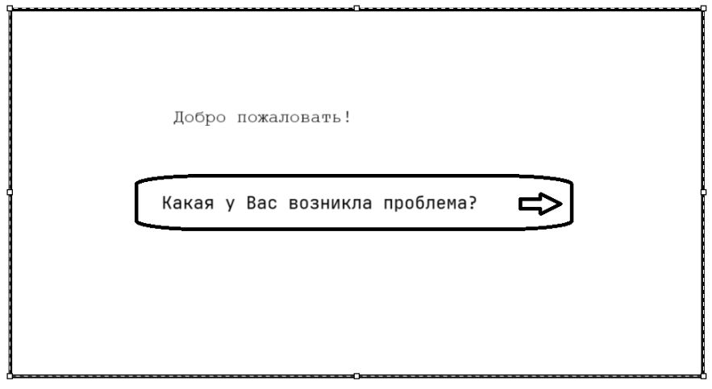
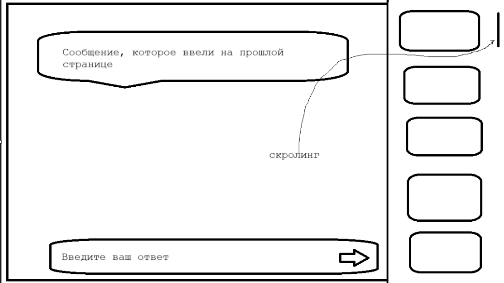
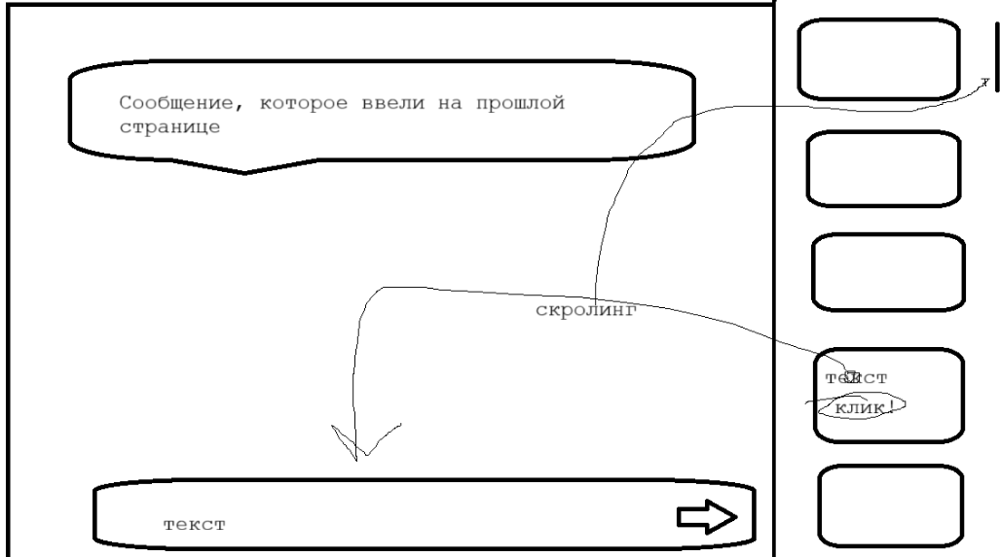
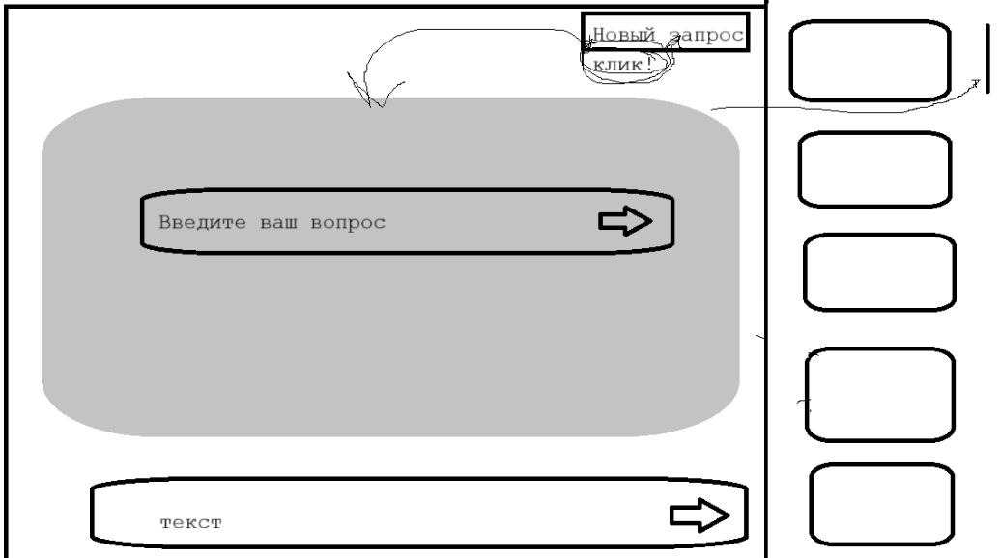

# Вид пользователя (UI)

## 1. Начальный экран

Пользователь открывает сайт и видит минималистичный интерфейс:  
одно поле ввода по центру с плейсхолдером **"Введите ваш вопрос..."**.  
После ввода сообщения и нажатия Enter/кнопки отправки — поле плавно перемещается вниз, формируя структуру чата.

## **Скриншот:** 

## 2. Основной экран (чат)

После первого отправленного сообщения интерфейс перестраивается в формат чата:

- Поле ввода закреплено **внизу**.
- Центр — основная область чата с сообщениями пользователя и поддержки.
- Справа — панель **подсказок ИИ**, оформленная как вертикальная полоса, которую можно прокручивать вниз.

## **Скриншот:** 

## 3. Оператор выбрал подсказку

При клике на одну из подсказок справа:

- Текст подсказки автоматически вставляется в поле ввода.
- Поле ввода расширяется пропорционально длине текста (до заданного предела).
- Если текста больше лимита — внутри появляется собственный скролл.
- Пользователь может редактировать вставленный текст перед отправкой.

## **Скриншот:** 

## 4 Новый запрос (UI и логика)

## **Скриншот:** 

### Расположение

- Кнопка **«Новый запрос»** расположена в верхней панели чата.
- Кнопка всегда видна .

### Поведение

- При нажатии открывается **модальное окно** по центру экрана, поверх текущего чата.
- В окне:
  - Одно большое текстовое поле с плейсхолдером **«Введите новый вопрос...»**
  - Кнопка **«Отправить»** снизу под полем

### Действия после отправки

1. Создаётся новый чат через.
2. История сообщений очищается.
3. Модальное окно закрывается.
4. Интерфейс возвращается в состояние **Пункт 2**.

### Примечания

- Список чатов не отображается.
- Один активный чат на пользователя.
- Кнопка «Новый запрос» используется для начала новой сессии без выхода на стартовый экран.
